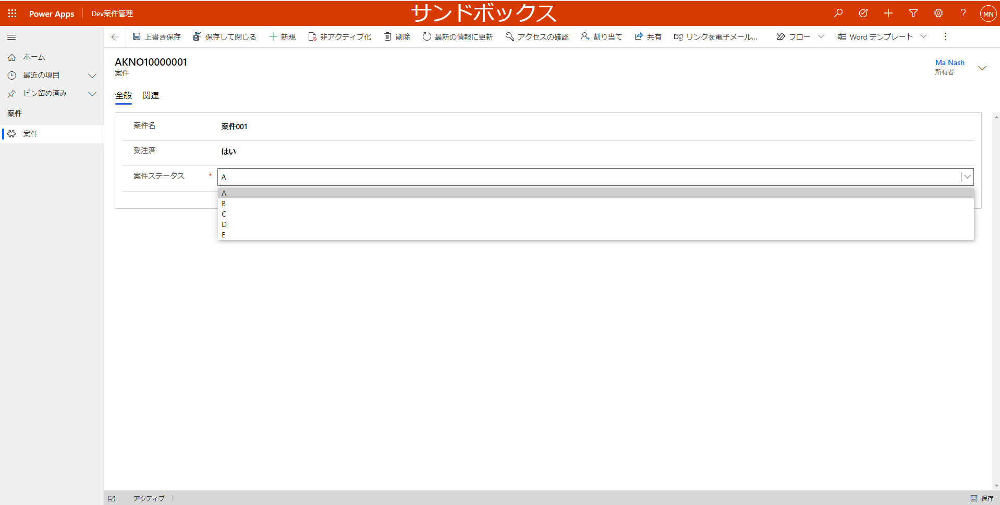
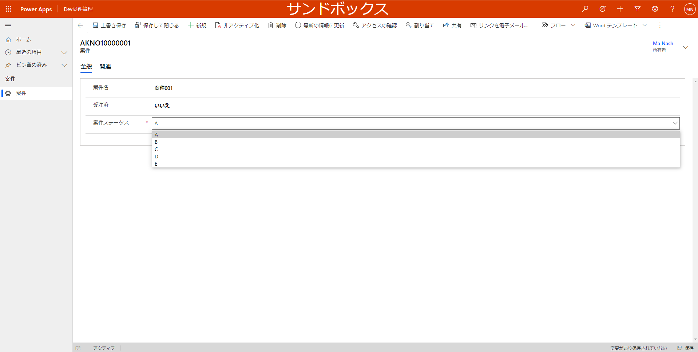
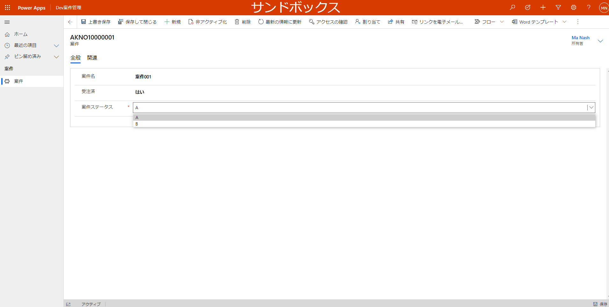
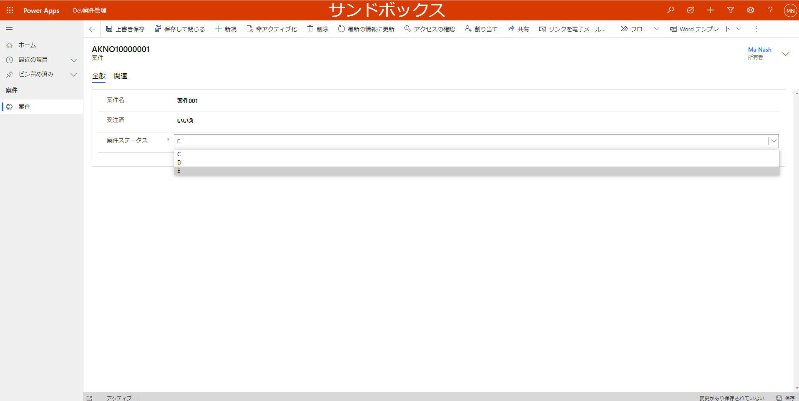

# D365Script.AddOrRemoveOption
# オプションセットコントロールにオプションの追加とリムーブ（adds or removes an option to control）
## ■変更前：スクリプトを追加した前に案件ステータスのオプションは「A、B、C、D、E」があります。👇

## ■変更前：スクリプトを追加した後に案件ステータスのオプションは「受注済」によって動的に変わります。👇
##### ①「受注済」が”はい”の時、AとBしか表示されない。
##### ②「受注済」が”いいえ”の時、C、D、Eしか表示されない。

